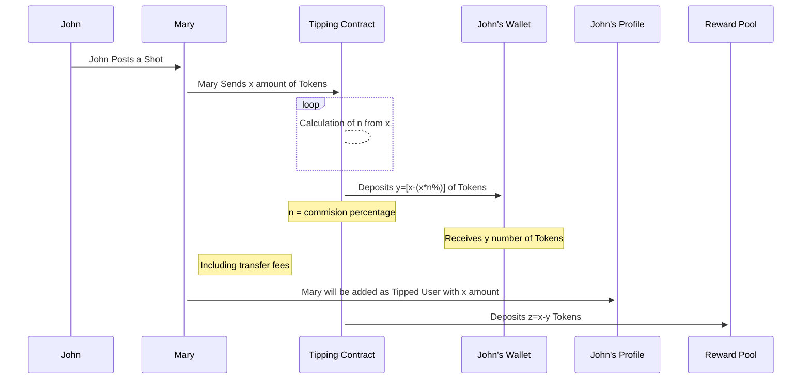
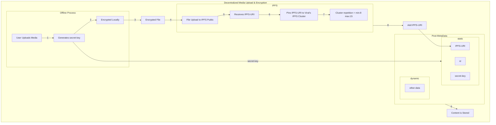
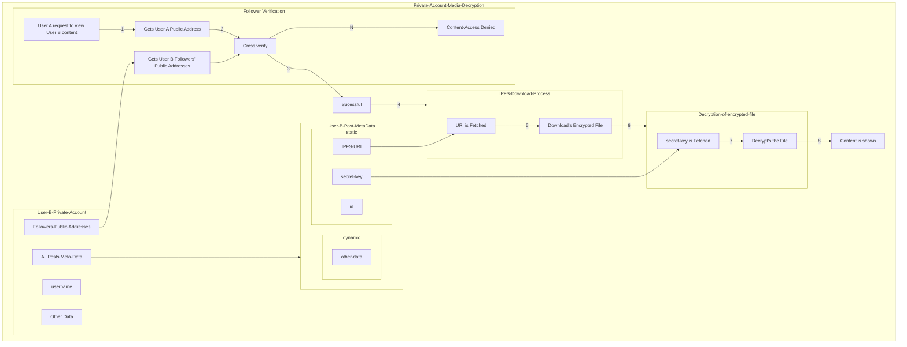
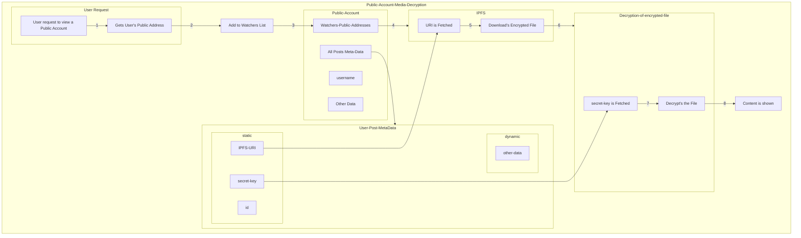

# <p align="center"> Viral - Next Gen Decentralized Social Engagement Tool</p>

<p align="center">By Viral Foundation & Viral DAO </p>
<br><br/>

## Table of contents

- [<p align="center"> Viral - Next Gen Decentralized Social Engagement Tool</p>](#-viral---next-gen-decentralized-social-engagement-tool)
  - [Table of contents](#table-of-contents)
  - [1. Abstract<a name="abstract"></a>](#1-abstract)
  - [2. User Problems & Basic Solutions](#2-user-problems--basic-solutions)
  - [3. Vision Statement](#3-vision-statement)
  - [4. Unified Mobile application - An Intro to Viral](#4-unified-mobile-application---an-intro-to-viral)
  - [5. Viral Platform Architecture](#5-viral-platform-architecture)
    - [Development Tech Stack](#development-tech-stack)
  - [6. How Whitepaper Structured](#6-how-whitepaper-structured)
  - [7.Social media & User Experience](#7social-media--user-experience)
    - [**7.1 Types of Post**](#71-types-of-post)
  - [7.2 Avatars](#72-avatars)
  - [7.3 Engagements](#73-engagements)
    - [7.4 Other Features](#74-other-features)
    - [7.5 User Security &amp; Privacy](#75-user-security--privacy)
    - [7.6. TOR/VPN Anonymity](#76-torvpn-anonymity)
  - [8. Blockchain, Token Ecosystem & Layer 2](#8-blockchain-token-ecosystem--layer-2)
    - [8.1 Viral Smart Chain – Short Intro](#81-viral-smart-chain--short-intro)
    - [8.2 IOTA Smart Contract Protocol.](#82-iota-smart-contract-protocol)
    - [8.3 Viral Smart Chains](#83-viral-smart-chains)
    - [8.4 Token Ecosystem](#84-token-ecosystem)
    - [8.5 Layer 2 Solution](#85-layer-2-solution)
  - [9. Smart Wallet](#9-smart-wallet)
    - [9.1 Viral Wallet](#91-viral-wallet)
  - [10. Child Platforms](#10-child-platforms)
    - [10.1 ROV Community](#101-rov-community)
    - [10.2 Dev-Space](#102-dev-space)
  - [11. Viral DAO & Governance](#11-viral-dao--governance)
  - [12. Viral Coin ICO](#12-viral-coin-ico)
  - [13. Roadmap to Decentralization](#13-roadmap-to-decentralization)
  - [14. Phase 2](#14-phase-2)
  - [13. Phase 3](#13-phase-3)
  - [14. Further Plans](#14-further-plans)
  - [15. Team](#15-team)
  - [16. References](#16-references)
  - [17. Glossary](#17-glossary)
  - [Others](#others)
    - [Smart Wallet Zero to Low Fee Transfers](#smart-wallet-zero-to-low-fee-transfers)
    - [Reward Pool](#reward-pool)


## 1. Abstract<a name="abstract"></a>


This is a Sample Abstract of the Viral Project.


## 2. User Problems & Basic Solutions

This is a Sample Problems of the Viral Project.

## 3. Vision Statement
Our vision is to bring the ultimate blockchain-crypto adoption to the masses. In order to bring adoption of crypto markets we would need to bridge social communication with defi and tokenized economy.

**Social media**

1. To develop a **Real-world Decentralised Social Media**
2. To build an **Autonomous** self-evolving platform
3. To build an **Interactive** Next-Gen Social Media
4. To make a **clean** web3 platform for all age groups

**Crypto Adoption**

1. To make people **jump in crypto** from fiat very easily & securely
2. To give **access** to all internet people cryptocurrencies **without investing**
3. To bring **all major crypto** for people to easily adapt in a **single wallet**

**NFT & Metaverse**

1. To democratize NFTs to Masses
2. To kickstart Metaverse adoption

**Blockchain**

1. To provide the utmost speed of transactions through **On-Chain & Off-Chain** solutions
2. To Develop a **feeless, fast, Capped Supply, Deflationary, smart contract chain**


## 4. Unified Mobile application - An Intro to Viral

A Next-Gen Social Media platform bridging interactive media, NFTs, and blockchain technologies' underlying applications into a Daily Internet User-Based Mobile App.

Every media shared on viral is a unique NFT where it can be utilized to create limitless possibilities across the platform. Users can share ultra-short to short videos, thoughts through text, sell NFTs and also make communication between one-on-one, private groups and, public channels with complete true privacy.

Viral users will be benefitted from zero ads, cryptographic encryption, censorship-resistant and, also use cryptocurrencies throughout the platform. Every user is a contributor to the platform where they receive rewards and incentives in Viral Coin for running the decentralized social media.

We are bridging Social Media with Blockchain, Wallets, Exchanges and NFT Markeplace to bring the ultimate one-app for the common masses to adop into the tolkenized economy

## 5. Viral Platform Architecture


1. **Viral App** – The Decentralized Social Media Platform bridging Blockchain applications for unlimited possibilities.

2. **Viral Smart Chain**: Horizontally Scalable Gas free EVM Smart Chain on Top of IOTA's Tangle.
   1. **Payment Channels (L2**): State Channels to move value off-chain for unlimited scalability
   2. **Zk-Rollups (L2)**: Batching Multiple NFT Tokens (ERC721) on L2 into L1
   3. **Viral Bridge**: To bring major crypto such as Bitcoin, Doge, ERC20 Tokens into Viral Smart Chain for interoperability
   4. **Additional Chain**s: Adding Additional Chains for Scaling Blockchain

3. **Smart Wallet** : Viral's Built in EVM Non-Custodial Wallet for Viral Smart Chain that allows user to receive rewards and hold ERC20 tokens.

   1. **Centralized Exchange**: Trustless Multi-Sig Wallet Exchange for Fiat to Crypto trading and vice versa
   2. **Decentralized Exchange**: Swapping Viral Tokens without KYC
   3. **P2P Exchange**: Peer-to-Peer Exchange for Fiat without KYC
   4. **Viral Name System**: Username based transfers instead of long cryptographic public address

4. **Child Platforms**: Platforms to support Viral App where the users rewarded daily according to their amount of contribution
     1. **Dev-Space**: Developers Feed for recent commits to opensource repo
     2.  **ROV App**: Curator Platform to vote and remove reported content on Viral
     3.  **Ad Platform**: Connecting Influencer and Business for trustless engagement-proof ads.

5. **Reward Program**: To incentivize users, miners, developers using smart contracts for their content, validation of transactions, and continuous development through unbiased points mechanism that offers more rewards to bigger contributors.

6. **Other Backend**: For contingencies which will be later decentralized in the further phases of Development Roadmap

### Development Tech Stack

1. **[IPFS](https://ipfs.io)**: IPFS stands for Interplanetary File System is a peer-to-peer distributed file system that is used for maintaining and distributing files across our Viral IPFS Private network.

2. **[GunDB](https://gun.eco/)**: GunDB is a fully decentralized graph database to store information from user to user meaning that your changes are not affected by any centralized server.


3. **[WebRTC](https://webrtc.org/)**: WebRTC stands for Web Real-Time Communication, an open-source project built primarily for peer-to-peer real-time connections.

4. **[Javascript](https://www.javascript.com/)**: JavaScript is a text-based programming language used both on the client-side and server-side that allows you to make web pages interactive.

5. **[NodeJS](https://nodejs.org/)**: Node.js is an open-source, cross-platform, back-end JavaScript runtime environment that runs on the V8 engine and executes JavaScript code outside a web browser.

6. **[ReactJS](https://reactjs.org/)**: React is a free and open-source front-end JavaScript library for building user interfaces based on UI components.

7. **[Solidity](https://docs.soliditylang.org/)**:Solidity is an object-oriented, high-level language for implementing smart contracts, mostly used for executing code in Ethereum Virtual Machine

8. **[IOTA Smart Contract Protocol](https://wiki.iota.org/smart-contracts/overview)**: The IOTA ecosystem allows to spin up a smart contract blockchain and anchor it to the IOTA tangle

## 6. How Whitepaper Structured

For efficient undertsnading, we have seperated the platform's major aspects into 5 categories.

- Social Media & User Experience (Page 1-10)
- Blockchain, Token Ecosystem & Layer 2 (Page 10-15)
- Smart Wallet (Page 15-20)
- Child Platforms (Page 20-25)
- Revenue & Incentives (Page 25-30)
- Viral DAO & Governance

## 7.Social media & User Experience

Viral is a multi-media sharing decentralized social network that brings meta-experience with friends, family and other people to communicate, share posts and send messages across the globe with absolute privacy. Viral sets NFT as a standard for every post that shared in the network which intends to bring interactive social experience and utility use cases of blockchain environment.

>Note : To bring NFT as a standard for a social media post doesn't necessarily means it should be sold for tokens, rather it is a unique piece of data in blockchain that gives the power of ownership which the user can keep himself or can be transferred to others if the user wants to via Open Bidding/Selling

```JavaScript //Since Solidity Syntax Not Available

//NFT Snippet for Enable/Disable Open Sale

pragma solidity ^0.8.10;

```

### **7.1 Types of Post**

> [ELI5 Explanatory Video - Viral NFTs](https://sample.com/)

**Shots**

Shots are **10 sec motion pictures** with added loop transitions to bring life to photos. Pictures can be shared as shots, an exciting looped motion picture.

 

People can share their
- Personal Sneak-Peek, Moments & Events
- Exclusive Photoshoots, commercials, to your fans
- Turn photos into lively shots by adding shot animations through Viral


**Thoughts**

Thoughts are **text-based sharing** for micro-blogging. Attach photos, long/short videos, documents, etc. There is no limit on words or media. People can share other users thoughts to their followers using re-Thought feature.


**Drops**

Drops are **20 second disappearing stories** shared to followers which auto-disappears once seen. It features AR filters, texts, shot elements, links, music, transitions and, much more. Every Drops will be purged in 30 days.

> Note: Drops will not be minted as unique NFT due to it's nature of disappearing media.


**Interactive Videos**

IVs are short 30sec full-screen **narration based videos**. It is based on **gamification of videos** to interact within the videos.


**NFT Utilities**

Minting (Creating) an NFT in Viral is **as easy as creating a social media post**. Viral provides multiple NFT utilities for users to mint, buy, sell with an easy user experience.

Viral will take a **3% commission** selling NFTs which will be reverted to the user's reward pool <!---Link the Reward Section here-->

**Tunes**

Artists can sell their music albums, singles as NFT for the fans/people to buy and own it


```JavaScript //Since Solidity Syntax Not Available

//NFT Snippet To Sell Multiple Copies

pragma solidity ^0.8.10;

```

**Sketch**
Digital arts, paintings, sketches can be sold through NFTs


```JavaScript //Since Solidity Syntax Not Available

//NFT Snippet to sell single asset

pragma solidity ^0.8.10;

```

**Originals**

Physical assets can be sold through Viral's Original NFTs where people can buy and flex


```JavaScript //Since Solidity Syntax Not Available

//NFT Snippet to provide extra information such as Name, Address, Mobile Number, before transferring coins with end to end encryption between seller

pragma solidity ^0.8.10;

```

**Tickets**
Exclusive passes for events, ownership of clubs, a digital ticket for everything can be sold as NFT


```JavaScript //Since Solidity Syntax Not Available

//NFT Snippet To Sell Multiple Copies

pragma solidity ^0.8.10;

```

**Filters**
Filters can be sold, and owned by user's thereby get rewards for it


```JavaScript //Since Solidity Syntax Not Available

//NFT Snippet to distribute share’s (Just like company share where if 100 NFTs is sold, the person who holds 50 NFT will hold 50% of the company)

pragma solidity ^0.8.10;

```

## 7.2 Avatars

Personalized Avatars are generated **free for every viral** user using a selfie. Users can edit their avatar skin, outfit, hair, etc. These avatars will be shown in their public profile where other users can see in 3D View.

These avatars are brought into Viral to integrate metaverse and to provide an **interactive experience** through avatar use cases.

> [Avatar Demo Video](https://sample.com/)

**SDKs Used** : ReadyPlayerMe - A cross-game Avatar Platform for the Metaverse


**Meta-Chat**

Meta-Chat is a feature to **react/show your facial reactions** in real-time for the messages of whom you chat with. Viral captures your face reactions and transfer it to your avatar on **top of your mutual-friend's chat page**.

This gives you a **virtual experience** of videocalls through avatars and text chat.

> [Meta-Chat Demo](https://sample.com/)

Formula or Flow Chart

**Live &amp; Rooms**

**Decentralized Live Video Events and Audio Rooms using Avatars** (or) Normal Cams. Celebrities can host live events with their fans using their avatars

> [Live Events Demo](https://sample.com/)


## 7.3 Engagements

**Like, Comment, Share, Tip**

Users can like, comment, share, reThought, and also tip Tokens to their favorite posts and influencers. The number of likes will influence the recommendations list of other users.

Additionally a hidden engagement dislike will be added to every post but won't be visible to the users/nor owners, which is solely used for recommendation interest-based algorithm to filter out disliked content

**Tip**

The tipping feature using tokens in Viral Smart Chain is used to tip/support your favourite influencers contents where all the tips will be directly sent to the user's wallet

```
Party A= Sender = Mary
Party B= Receiver = John
Party C= Tipping Contract
Party D- Reward Pool

x=number of tokens mary sent 
y=number of tokens john receives 
n= Commission Percentage 
z= number of tokens sent to reward pool
```



```JavaScript //Since Solidity Syntax Not Available

//Tipping Snippet

pragma solidity ^0.8.10;

```

### 7.4 Other Features

**Privacy Groups**

Privacy Groups is a unique feature in Viral to create unlimited friend's groups as list to ensure maximum privacy for users to post and share shots, drops, thoughts, NFTs to the particular groups of users i.e., Family, Friends, Close Friends, Besties, etc. This feature can enable complete privacy over viewers for certain posts.

  ```mermaid

    flowchart LR
    A[User]-->0
    0[3 Friends x,y,z]-->B[Group A]
    0--->C[Group B]
    B-->D[Read Access:x,y]
    C-->E[Read Access:y,z]
    D-->F[Restricted User:z]
    E-->G[Restricted User:x]

  ```


```JavaScript
//GunDB Snippet
```


**Audio Emoji**

This is a short feature where all the emoji's in Viral if touched will give a **short sound of the emoji**. This will be available on chats &amp; comments section of a post.

**Interest Based Recommendation**

To make the viral platform more user-friendly interest-based recommendations are used. We have numerous ways to fetch interest from a user **without collecting data on a centralized server**, some of them are

- Like &amp; Dislike
- Hashtag Follows
- Search-Based Interests
- Based on Activity
- Shares with other friends
- Following interests
- Based on Comments

All the user interests will be **stored locally** on the device to ensure **maximum security** and will be taken to show recommendations.

### 7.5 User Security &amp; Privacy

This is classified into

  1. Media Storage
  2. Chats or Private Messages
  3. Interests of User
  4. Chat backups

**1. Media Storage**

All Media uploaded to Viral is End-to-end Encrypted where all the files are encrypted using Symmetric AES-256 Encryption Standard on the device and gets uploaded to Trustless IPFS Public Nodes & Trusted IPFS Cluster Nodes. Thus promising the security of media.

**Encryption**

Detailed Explanation


**Decryption**

Private Account Media Decryption

Detailed Explanation


Public Account Media Decryption



**2. Chats &amp; Private Messages**

For Chat-based encryption, we use **public and private key** encryption method. There are no centralized cloud-based servers involved in storing messages which can potentially leak private chats and messages. Every single message is encrypted and can be only decrypted by the receiver.

Public-Private key encryption more secure than a single shared key used in multiple chat platforms.

Visual Representation

Alice writes &quot;Hello&quot; to Bob – Bob Receives an encrypted message - Bob decrypts using his private key – Bob Sees &quot;Hello&quot; from Alice

>[GunDB Explanatory Video](https://www.youtube.com/watch?v=-SiLnaSDkh4)

**3. Interests of User**

Users' interests will be **saved locally** on their devices ensuring full privacy of personal data.

**4. Chat Backup**

Since Viral is a **Offline-First Chat** messages will not be stored in cloud. To Backup messages Viral will offer **cloud options** such as Google Drive/Dropbox where you can securely encrypt and save your **backup**. While Migrating to another mobile we will be providing a feature to transfer existing messages/interest to your new device.

**Phase 2 Development**

We will be focussing on Quantum Resilience of all media encryption used in Viral while commencing the Phase 2 of Development Roadmap

### 7.6. TOR/VPN Anonymity

Viral will be a safe haven for anonymity, privacy, and security in eliminating the tracing of users' identities by exploiters . Users can benefit from TOR &amp; VPN Routing Features built in our Decentralized application to hide their IP address and go fully anonymous.

TOR routes you through several additional nodes while encrypted, no one can trace it back to you. VPN will redirect your internet traffic through a secure tunnel, hiding your IP address and encrypting your data in the process.

**Content Delivery**

Visualization with changes to minting as NFT

\*\*AES – 256 Encryption Snippet\*\*

**IPFS Cluster**

Visualization of Repetition

Addition of Nodes – Trusted Way

Phase 2 – Trust less Way (IPFS-VM)

## 8. Blockchain, Token Ecosystem & Layer 2

### 8.1 Viral Smart Chain – Short Intro

Viral Smart Chains, is a network of horizontally scalable EVM Chains on top of IOTA Tangle used for Viral Social network with fully deployed defi ecosystem with Off-Chain solutions. Viral Smart Chains aim to provide an easy understandable one-platform for all the non-crypto users who are subjected to higher gas fees, congestion in network, volatility and scattered defi solutions.

### 8.2 IOTA Smart Contract Protocol.

IOTA provides an Off-Chain Smart Contract Solution for developers to create multiple-chains on Top of IOTA's immutable Tangle. Since Ethereum transactions are processed On-chain by every single node on its network, it faces additional congestion, slow transaction time and subject to higher miner fees. IOTA's off-chain smart contract solution makes use of blockchains anchored to the Tangle where the smart contracts are ran and achieved consensus with small set of committee nodes. This achieves a high scalable throughput and immutable records since the states of smart contracts such as Account Balances, Input Conditions and Consequences over time are updated on IOTA's Tangle.

**Architecture**

Architecture FlowChart

There are several components to understand more about IOTA's Smart Contracts Protocol. It gives us multi-chain functionality to run smart contracts from different chains which allows a horizontal scaling of blockchains without a need for plasma or side chains.

**Consensus and Validators**

IOTA's Smart Contract Chain uses a Byzantine Fault Tolerant (BFT) Algorithm, which guarantees consistency and byzantine fault tolerance if less than ⅓ of nodes are malicious. So the verification process runs on Nodes within a chain committee. With a Proof-of-Stake Consensus each Viral chain will be run by a network of validator nodes, which run a consensus on the chain state updates. The validators of the chain (Nodes) form a committee, a bound together closed set of nodes. The committee of the chain can allow new validators and validator nodes to be added or replaced. This also makes the chain itself agnostic to its validators (the committee).

Viral Smart Chains leverages IOTA Tangle's properties of scalability, high throughput, feeless transactions and immutable records. Only when a supermajority of the validators (the quorum) of a chain reaches [consensus](https://wiki.iota.org/smart-contracts/guide/core_concepts/consensus), the results get added to the chain where a new state update can be signed, which unlocks the AliasOutput for the chain and produces the next state UTXO which is stored on the Tangle as an immutable record. In summary, the chain's state (data) will be stored on Tangle as an immutable record.The amount of the validators to reach a consensus is configurable for each chain. The committee itself can also be variable in size - from a few nodes up to hundreds of nodes, and each node can be part of many different committees.

  - **Validators** – Each Single Node running the Chain
  - **Committee** – The Group of Nodes running a chain
  - **Quorum** – Number of Nodes to be in consensus to validate a transaction

To know more about IOTA's Smart Contracts : [Whitepaper](https://files.iota.org/papers/ISC_WP_Nov_10_2021.pdf), [Documentation](https://wiki.iota.org/smart-contracts/overview), [Blogs](https://blog.iota.org/iota-smart-contracts-beta-release/)

### 8.3 Viral Smart Chains

Viral Smart Chains are a family of separate chains anchored to the IOTA's Tangle where each chain can communicate with each other via intermediary L1 Value Tangle.

**Viral's Approach**

A Single chain will seem complex for setting different fees for different actions on the blockchain i.e Smart Contract Calls/Deployment, Sending Tokens to other Address, etc. Viral's approach is to bring multiple chains categorized by its purpose to serve the Viral Application with fee structure thereby also creating separate chains to provide zero network fees for minting NFTs on Viral App (ERC721 &amp; ERC1155) while rewarding the validators of all Viral chains (including zero fee chains) from the miner pool (total collected fees of all chains) based on validator's total validated transactions for the day through an automated smart contract.

**Validators**

Viral Chains will work on Proof-of-stake consensus where validators (miners) are required to stake their Viral Coins in order to participate in the network for validating transactions. The mining power in proof-of stake depends on the amount of coins a validator is staking. Participants who stake more Viral Coins will be most likely to be chosen to add more blocks. When a transaction is validated and attain consensus by the quorum of validators (Read IOTA Protocol), the state of the transaction/smart contract will be recorded in the Value Tangle's UTXO Ledger which makes it immutable. The Transaction will be secured by the validators inside the Viral chain and also the L1 UTXO Ledger.

**Fees**

Viral Smart Chain is built primarily to ease the need for gas-based transaction fees like other smart contract blockchains. Transaction fees are only leaved as a fixed percentage as &quot;transfer fee&quot; in Viral Smart Chains for Sending, receiving tokens between accounts and smart contracts.

Transfer fees are fixed at 0.05% of transfer value of the tokens paid in Viral native coin. The minimum fee is capped at $0.0005 of the fiat value of Viral Coin which is determined using price oracles.

Visualization

Native Token : Bob wants to transfer 100VRL to John : Fee leaved will be 0.05 VRL

Other Tokens : If 1 vMATIc = 0.1 VRL

Mike wants to transfer 6000 vMATIC to Mia : Fee leaved will be 0.30075 VRL (approx. 3.0075 MATIC) including Swap and Transfer Fee

**NFT Chains**

Currently on popular smart contract blockchains such as Ethereum, Polygon the amount of gas required for a transaction is determined by the demand for the transaction to be included, regardless of what type of transaction it is where it is dynamically adjusted based on number of user's interacting with the network at the time.

This brings us to an effect that a single blockchain cannot set certain fees or eliminate gas fees for a particular type or category of a transaction regardless of it's nature i.e, smart contract, account transfer. Multiple parallel state blockchains can solve this issue by altering few blockchains as permissioned for a certain use cases and can make it feeless without hindering the other fee-based chains.

Viral's aim to democratize NFT to the masses and bring massive NFT Adoption we will be running separate zero-fee chains for deploying ERC721 &amp; ERC1155 Token directly from the Viral Application. The Validators for the chain will be open to join the network where they'll be rewarded from the miner pool (total fee collected) based on the total transactions they validate in a day.

**Family of Chains**

- **Genesis Chain** : Initialization of First Chain with Viral Coin and Stable Coin Deployment with Smart Contracts that defines governance, fees, etc

- **General Chains** : For Every n number of active Viral Wallet users a new general chain is deployed. These chains are used to store user funds and create new accounts on the blockchains. So Users can do intra and inter chain transactions with high throughput and flexible scaling.

**DeFI Chains**

- **Smart Contract Deployment Chains** specifically for categorized DApps

- **DEX Chain** : Running smart contracts for Viral Wallet's Decentralized Exchange

- **ERC20 Chain** : To Deploy new ERC20 Tokens that can be transacted between chains and accounts

- **Viral NFT Chain** : Feeless Viral ran Smart Contract Chain specifically to deploy user's NFTs on-chain

- **ERC721/115 Chain** : To deploy new Non-Fungible Tokens for other platforms outside the Viral Application

- **Marketplace Chain** : To create smart contract based marketplaces for NFTs and much more

- **Other Chains** : For creating Dapps for lending, asset tokenization, yield farming, tools and infrastructure, etc

Development

      _Core-Contracts_

      _Root_

      - _Initialization of the chain_
      - _Deployment of new contracts_
      - _Registary of contracts_
      - _Chain ownership management and Access control list_
      - _Fee management_

      _Accounts_

      - _On Chain ledger accounts_
      - _Securely moving tokens between accounts_
      - _Ensuring consistency of the on-chain ledger_

      _Eventlog_

      - _Keeping timestamp immutable log of On-Chain events_

      _Blob_

      - _Keeping registry of Binary objects of arbitrary sizew_

      _Configuration of Committee and quorum_

      _Wasp Nodes_

      _EVM Plugins_

      _Configuring Fees_

      _Smart Contract Deployments_

      _State Updates on Tangle_

      _Multi-Chain Integration_

      _Core-Contracts_

### 8.4 Token Ecosystem

**Native Token**

Viral Coin is the native currency, a digital coin that does all the operations inside the Viral Smart Chains. It is used to store value, send and receive funds within the Multi-Chain Viral Blockchains. Viral Coin is used for paying fees inside the network, staking, governance, rewards and much more.

**Viral Stable Coin**

Viral Stable Coin is a sub-native token, an algorithmic stable coin pegged to the US Dollar that is widely used in the Viral Application for sending and receiving tokens across users wallets. Due to constant volatility of the crypto market there is a barrier for the common people and businesses to get into cryptocurrencies. As Viral's aim to become the one-stop crypto solution for the masses we are providing a way for the user's to automatically transact in Stable Coin without any complex need for swapping their current tokens. In Short, when an user transact in Viral Coin, it will force swap and send the receiver viral stable coins to avoid depreciating of the asset while transacting.

As far as we know there are several stable coins are in the market 1.Fiat-Peg Centralized, 2.Crypto Collateral 3. Algorithmic. In our case we can take 3 coins 1. USDC 2. DAI 3. AMPL. USDC maintains the peg but holds the funds on its reserves centralized which comes with its demerits. DAI aims to maintain the peg using collateral of several crypto coins, in which USDC hold the reserve of more than 50% of the DAI's crypto backing, which also makes DAI a centralized cryptocurrency. AMPL is an algorithmic stable coin which maintains it's peg by contracting and expanding it's supply of tokens to achieve stability, this achieves true decentralization but fails to operate swiftly for sudden price movements due to it's rebase function ran in a stipulated time and also rebases in a slow, long way which takes upto a week after a sudden price movement. This is where most crypto projects fail to provide a decentralized stable currency for the masses.

Terra blockchain is the most successful running algorithmic stable coin which maintain its stability by changing the stable coin's supply by burning and minting it's native token LUNA. In better words, when Terra (Stable Coin) demand increases to more than $1, Luna (Native token) will be burned and New Terra tokens will be minted, where increase in supply of tokens resolves the demand and maintains the peg of the stable coin and vice versa. Viral Stable Coin adopts the algorithmic stable coin algorithm used in many of Terra's stable coins.

Viral Coin and Viral Stable Coin will be the two primary coins in the Viral Social Platform. The supply and demand of Stable Coin is always balanced by making Viral Coin as it's variable counterweight that absorbs it's volatility.

**1 VSC - $1 (Expansion)** : When Viral Stable Coin trades at a price that is high relative to it's $1 peg i.e., $1.15, the demand for VSC is higher than the circulating supply. To bring the peg back to $1, the supply of VSC should be increased to balance the demand. During Expansion State trading bots will mint VSC by burning VRL, which has an effect of lowering Viral Stable Coin Price (by expanding the supply) and increases the Viral Coin price (by reducing it's supply). The smart contracts will trade until the price peg of 1 VSC = $1 is achieved.

**1 VSC - $1 (Contraction)** : When Viral Stable Coin trades at a price that is low relative to it's $1 peg i.e., $0.95, the demand for VSC is lower for the circulating supply. To bring the peg back to $1, the supply of VSC should be decreased to balance the demand. During Contraction State trading bots will burn VSC and mints VRL, which has an effect of increasing Viral Stable Coin Price (by reducing it's supply) and lowering the Viral Coin price (by expanding it's supply). The smart contracts will trade until the price peg of 1 VSC = $1 is achieved.

**Viral Stable Trading App**

High Frequency trading cannot be run using automated smart contracts to maintain price peg of Viral Stable Coin. Users can stake their Coins, run automated arbitrage trading and receive profits using the Viral Stable Trading Application a separate application to maintain the peg of Viral Stable Coin

Users will be able to stake both coins VRL &amp; VSC proportionally to a smart contract in the mobile app which process all transactions of burning and minting VRL for VSC automatically without the need for user signature and receive profits from arbitrage opportunities by minting the burning the coins to balance the volatility. The Smart Contracts will add &amp; subtract coins on each pools to maintain stability.

**Viral Bridge**

- Abstract
- Story
- Bridge-Intro
- Smart Contract Chain Bridge
  - Content
  - Currencies
  - How it works
- UTXO Blockchain Bridge
  - Content
  - Currencies
  - How it works

### 8.5 Layer 2 Solution

**Payment Channels (State Channels)**

- Abstract
- Story
- Viral Lightning Payments
  - Intro
  - Fees
  - Routing Nodes
  - How it works
  - Development Procedure


## 9. Smart Wallet

### 9.1 Viral Wallet 
  - Abstract
  - Story
  - Intro
  - Buy/Sell - Fiat
    - Viral CEX
      - Abstract
      - Story-Problems
      - Intro
      - Short Features
      - Multi-Sig Wallet
      - Shamir's Secret Sharing Scheme
      - Instant Non-custodial-Wallet Withdrawal
      - Order Book Exchange
      - Trade Fees (Makers & Takers)
      - Makers Incentives
      - In-App KYC/AML
      - Exchange Markets
      - Conclusion
  - Crypto Swaps
    - Abstract
    - Story-Problems
    - Intro
    - Liquidity Pools
    - Fee Structure
    - Staking Rewards
    - Price Impacts
    - Oracles
    - Conclusion
  - Atomic Swaps
    - Abstract
    - Story-Problem
    - Intro
    - Short Features
    - Importance
    - Fee Structure
    - Makers Incentive
    - Others
  - P2P Selling
    - Abstract
    - Story-Problem
    - Others
  - Transfers
    - Abstract
    - Story-Problem
    - VNS
      - About
      - Snippet
      - Diagram
    - Lightning Payments
    - How Transfer Works
  - Custodian Services
    - Abstract
    - Safety of Funds
    - Offline VMs
  - Other Viral Wallet Features
    - Send as Stable Coin

## 10. Child Platforms

  - Abstract

### 10.1 ROV Community

  - Abstract
  - Story-Problem
  - Intro


### 10.2 Dev-Space

## 11. Viral DAO & Governance

  - Abstract
  - Story
  - Governance Model
  - Intro

## 12. Viral Coin ICO

## 13. Roadmap to Decentralization

## 14. Phase 2

## 13. Phase 3

## 14. Further Plans

## 15. Team

## 16. References

## 17. Glossary


**Incentives for Viral ICO Investors**

    Pre-Sale Opportunity for all the ICO Investors on the Viral DAO Launch

    Pre-Launch opportunity to test Viral App before the Beta-Lauch

    Recognition NFT Airdrop for Initial People who worked to bring Viral Above

    ICO Presale, Sale, Post Sale

    ICO no cap, hard cap – 10M$

    ICO Holding Period until 7 months (Beta-launch)

    Active Support for co-creation

**Use Cases for VRL – Leading to Capital Gains**

    Native Token for Transaction

    Primary Token in Viral App

    NFTs &amp; Payments

    Staking and Nodes Collateral

    Capped Supply with No inflation

    Reward Coin for all App users

    No of Wallets = No of App users

    Burning of Uncollected Rewards

    Stable Coin Demand = Burning VRL coins

    Burn Tax 30% of All Transaction Fees

    Viral CEX Major Fiat Pair (VRL-USD, etc)

    Governance for Viral Smart Chains Protocol


**Use Cases of VSC**

    Payments for Merchants

    Send as Viral Stable Coin Feature

    Volatility Proof for Payments

    Viral CEX Fiat-Crypto Major Coin

    Real World Payment Solution

    Use Cases of Bridged Tokens

    Bringing other blockchain coins to Viral Smart Chains

    Low Transaction Fee

    Access to Viral NFTs

    Payments to Merchants

    Automated Swap to Stable Coin


## Others

### Smart Wallet Zero to Low Fee Transfers


### Reward Pool


